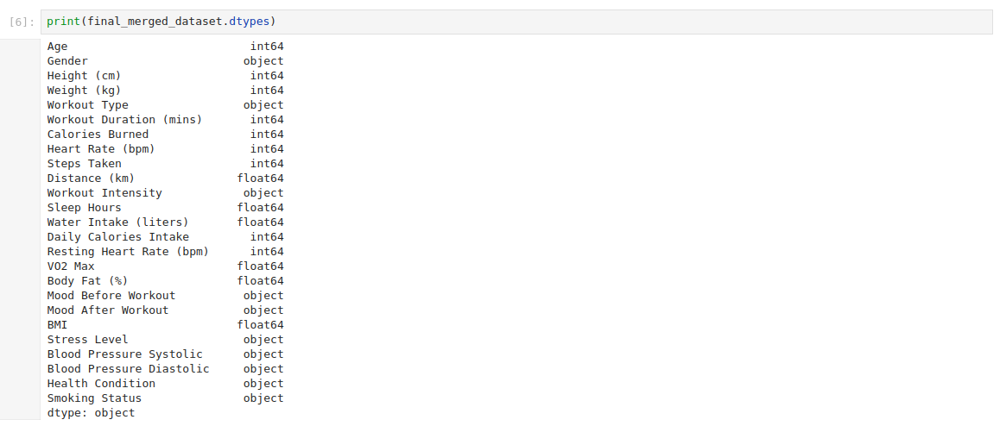
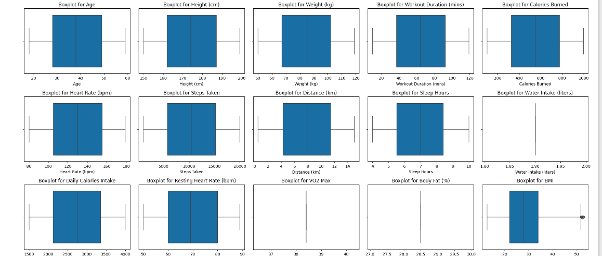
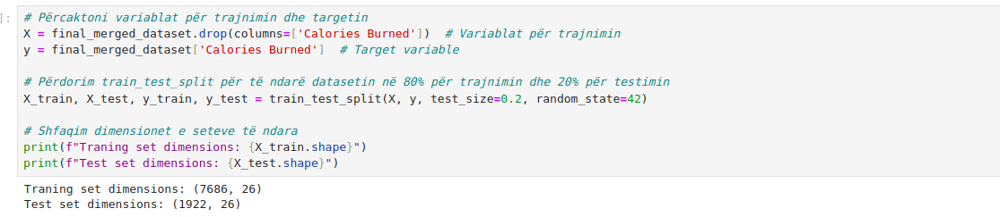
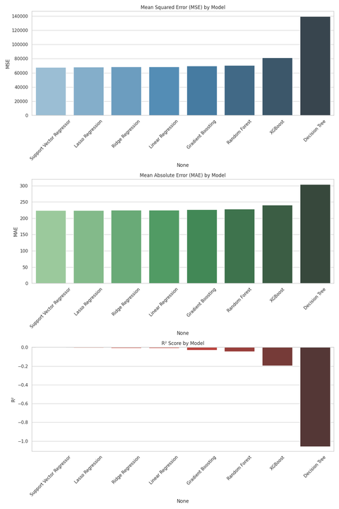
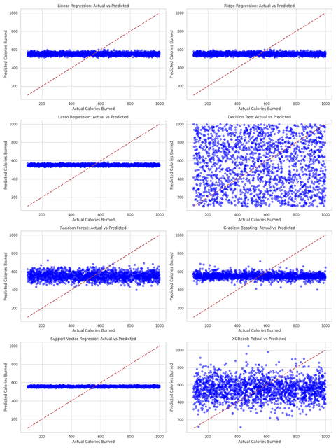

# Application of Machine Learning Algorithms for Physical Activity Analysis in the Workout & Fitness Dataset

## University and Contributors

- **University**: University of Pristina
- **Faculty**: Faculty of Electrical and Computer Engineering
- **Level**: Master's
- **Course**: Machine Learning
- **Mentor**: Dr. Sc. Lule Ahmedi & Dr. Sc. Mërgim H. HOTI
- **Students**:
  - Altin MUSLIU
  - Edi MORINA
  - Fisnik MUSTAFA

## Table of Contents
- [Dataset](#dataset)
- [Overview](#overview)
- [Goal](#goal)
- [Phase1: Preparing the Model](#phase)

## Dataset

This script works with two datasets:

[Workout & Fitness Tracker Dataset](https://www.kaggle.com/datasets/adilshamim8/workout-and-fitness-tracker-data): This dataset contains fitness-related attributes such as Age, Height (cm), Weight (kg), Resting Heart Rate (bpm), BMI, and other workout statistics. It serves as the primary dataset, and most of the features come from this file.

[FitLife: Health & Fitness Tracking Dataset](https://www.kaggle.com/datasets/jijagallery/fitlife-health-and-fitness-tracking-dataset): This dataset includes additional health-related information, such as Blood Pressure, Stress Level, Smoking Status, Health Condition, etc. These attributes are merged with the first dataset based on matching features (like Age, Height (cm), Weight (kg), and BMI), allowing us to enhance the information in the first dataset and make it more unique.

The primary focus is on matching the individuals between the two datasets using common features, while adding supplementary information from the second dataset to enrich the data for further analysis. The final (merged) dataset contains 10000 rows and 22 attributes.

## Overview

This repository focuses on developing a machine learning model to generate personalized fitness workout plans. The project leverages a dataset of fitness and workout data to create a tailored experience based on individual needs and goals. The ultimate aim is to help users optimize their workouts by recommending exercises, intensity, and schedules that align with their fitness levels and objectives.

## Goal

The goal of this project is to build an intelligent system that can analyze user fitness data and suggest effective workout plans. By applying machine learning techniques, we aim to make fitness recommendations that are adaptive, efficient, and tailored to the specific needs of individuals.

## Phase 1: Preparing the Model

The first phase of this project focuses on preparing the dataset and building the foundational machine learning model.

### 1. Data Loading & Cleaning

The script starts by loading two datasets, performs the following:
- **BMI Calculation**: Adds a new column `BMI` to `dataset1` using the formula `Weight / Height^2`.
- **Gender Standardization**: Maps gender labels (`Male`, `Female`, `Other`) to a consistent format (`M`, `F`, `Other`).
- **Renaming Columns**: Ensures column names are consistent between the two datasets.
  
  We merged the Workout & Fitness Tracker Dataset and the FitLife: Health & Fitness Tracking Dataset into one dataset:
  

  Types of Columns From Merged Datasets:
   

### 3. Data Merging & Outlier Removal

- After matching the data, the script merges relevant columns from `dataset2` with `dataset1` based on the nearest neighbor results.
- Outliers are detected and removed using the IQR method for `BMI`, `Blood Pressure Systolic`, and `Blood Pressure Diastolic`.

Outlier visualization using box plots:
 

### 4. Encoding & Feature Engineering

- **Label Encoding**: Columns with categorical values such as Mood and Smoking Status are encoded using `LabelEncoder`.
- **One-Hot Encoding**: Categorical columns such as Workout Type and Intensity are one-hot encoded using `pd.get_dummies()`.

### 6. Data Scaling

The numeric features are standardized using `StandardScaler` to ensure they have zero mean and unit variance, which is essential for machine learning models.

### 7. Data Splitting

The final dataset is split into training and testing sets (80%/20%) using `train_test_split()`.

### 8. Saving the Final Dataset

The cleaned and preprocessed dataset is saved as `processed_dataset.csv` in the current working directory.
 
## Phase 2: Model Training

In the second phase of the project, we focus on building and evaluating various machine learning models to predict the number of **Calories Burned**.

### 1. Feature Selection and Correlation Analysis

- A correlation analysis was conducted between all features and the target variable `Calories Burned`. 
- Features were selected based on their relevance to the prediction task, with a focus on numerical attributes such as Age, Height, Weight, Workout Duration, Heart Rate, Sleep Hours, BMI, etc.
  
  Visualization of the correlation between Calories Burned and other columns:
  

### 2. Data Normalization

- All selected numerical features were standardized using **StandardScaler** to bring them to a common scale.
- This step is essential to ensure that features with different units (e.g., height in cm vs. calories) do not disproportionately affect the model performance.

### 3. Splitting the Data

- The dataset was split into **training** (80%) and **testing** (20%) subsets using `train_test_split`.
- The feature set `X` contains all columns except `Calories Burned`, which is the target variable `y`.
  
  Visualization of the training and testing data:
 

### 4. Model Selection and Training

Several regression algorithms were trained and evaluated on the dataset:

- **Linear Regression**
- **Ridge Regression**
- **Lasso Regression**
- **Decision Tree Regressor**
- **Random Forest Regressor**
- **Gradient Boosting Regressor**
- **Support Vector Regressor (SVR)**
- **XGBoost Regressor**

Each model was trained on the training data and tested on the test data.

### 5. Model Evaluation

Models were evaluated using three key metrics:
- **Mean Squared Error (MSE)**
- **Mean Absolute Error (MAE)**
- **R² Score**

The results were stored in a DataFrame and saved in a file named `model_performance_metrics.csv`.

**Model Performance Visualization:**

- Bar plots were generated to compare the performance of each model in terms of MSE, MAE, and R² Score.
  

**Actual vs Predicted Visualization:**

- Scatter plots were also created to compare actual vs. predicted values for `Calories Burned` for each model.

### Additional Observations and Conclusions

As a conclusion, the data used for training the model is not ideal. Additionally, the correlation between the features and the target variable is quite low. Apart from **Calories Burned**, we tested several other columns as potential targets, but the results still showed weak correlations. This suggests that the selected datasets do not contain high-quality data for training the model effectively. To achieve better model performance, it is necessary to replace the current datasets with new and more relevant data.

