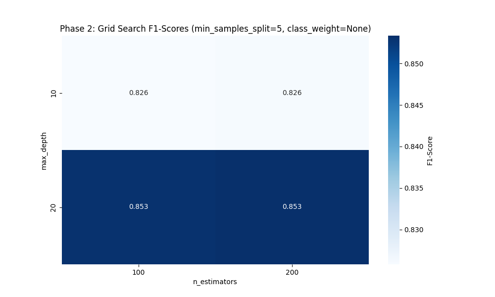
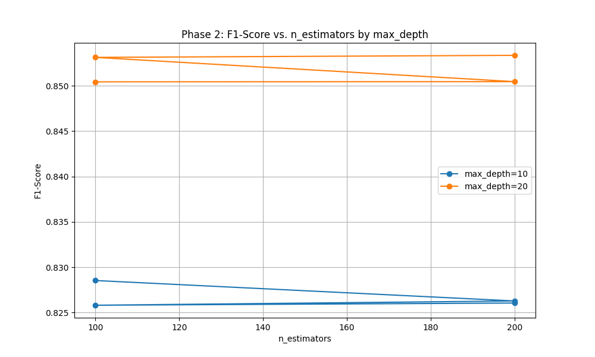
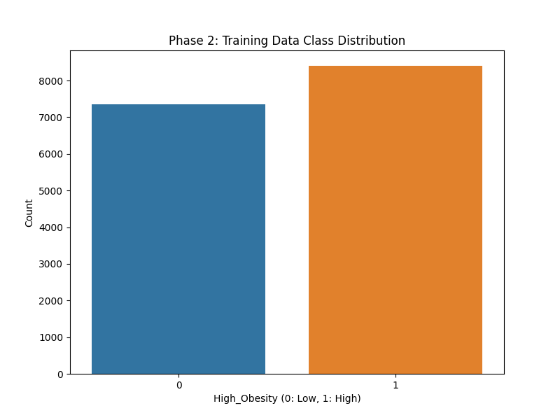
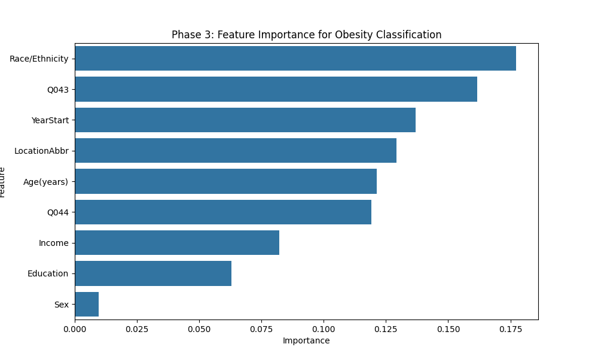
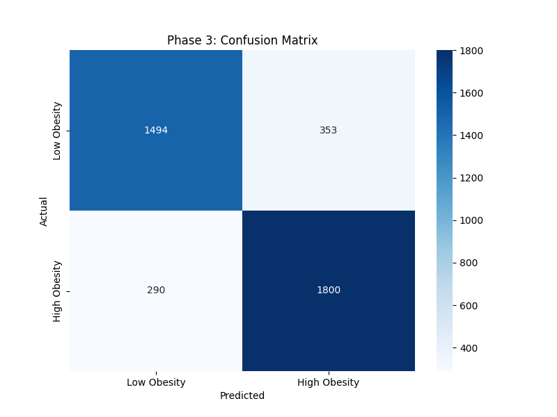
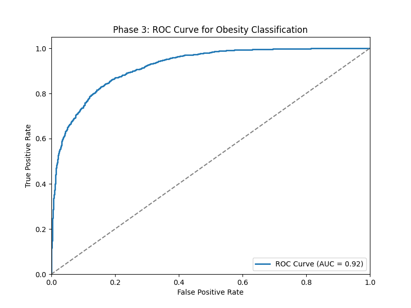
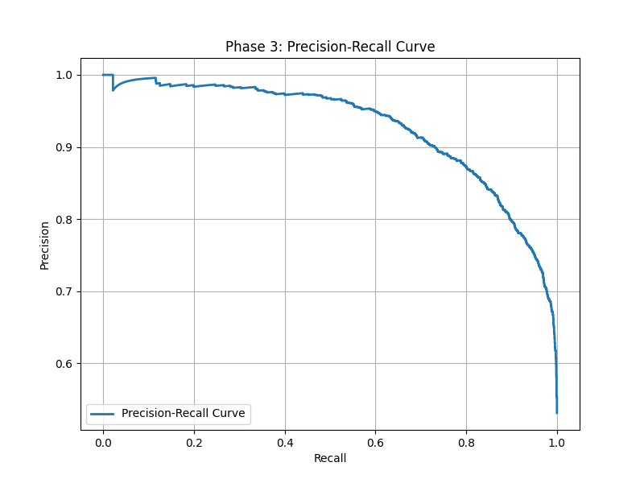
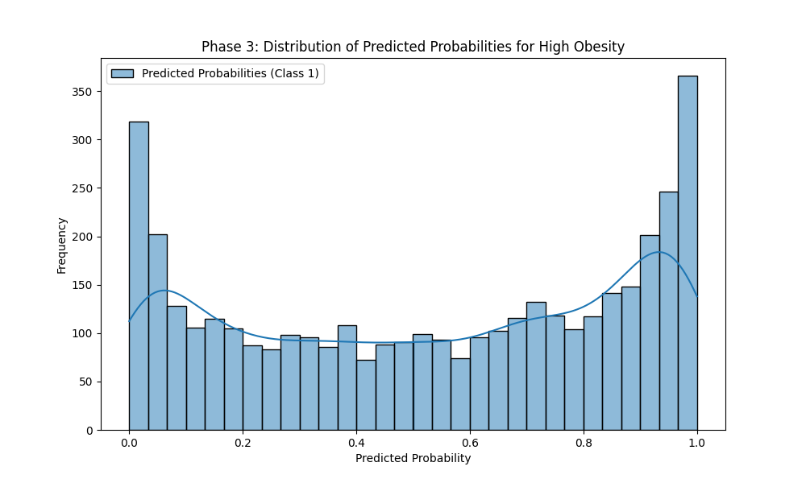

# Classifying High Obesity Prevalence in U.S. Populations Using BRFSS Data

## 📑 Table of Contents

1. [Dataset Overview](#dataset-overview)  
2. [Phase 1: Data Preparation](#phase-1-data-preparation)  
   - [Target Variable](#target-variable)  
   - [Feature Selection](#feature-selection)  
   - [Handling Class Imbalance](#handling-class-imbalance)  
   - [Preprocessing Summary](#preprocessing-summary)  
3. [Phase 2: Modeling](#phase-2-modeling)  
   - [Model Choice](#model-choice)  
   - [Hyperparameter Tuning](#hyperparameter-tuning)  
4. [Phase 3: Evaluation & Interpretation](#phase-3-evaluation--interpretation)  
   - [Performance Metrics](#performance-metrics)  
   - [Visualizations](#visualizations)  
   - [Feature Importance](#feature-importance)  
5. [Conclusion](#conclusion)


## 📊 Dataset Overview

This project utilizes Behavioral Risk Factor Surveillance System (BRFSS) dataset, specifically the **[“Nutrition, Physical Activity, and Obesity”](https://catalog.data.gov/dataset/nutrition-physical-activity-and-obesity-behavioral-risk-factor-surveillance-system)** subset — a comprehensive, annually updated health-related telephone survey system managed by the U.S. Centers for Disease Control and Prevention (CDC). The BRFSS collects data from all 50 states, the District of Columbia, and U.S. territories on health-related risk behaviors, chronic health conditions, and use of preventive services.

### 🔍 Purpose of Dataset Use

In this classification task, the dataset is used to **predict whether a specific population segment** (based on state and demographic characteristics) **has a high prevalence of obesity**. This binary classification is driven by responses to health-related survey questions, particularly:

- **Q036**: Measures the percentage of adults who are obese (BMI ≥ 30).
- **Q043 & Q044**: Capture physical activity behaviors such as exercise frequency.

### 📑 Attributes

The raw dataset contains **33 columns**, but we selected a relevant subset focused on **obesity and physical activity** indicators for the classification task.

#### 🔑 Key Columns:
- **YearStart**: Year the survey was conducted (e.g., 2011–2023).
- **LocationAbbr**: U.S. state or territory abbreviation (e.g., AK, WY).
- **Age(years)**: Age group (e.g., “18–24”, “35–44”).
- **Sex**: Gender (e.g., Male, Female).
- **Education**: Education level (e.g., “High school graduate”).
- **Income**: Income range (e.g., “$15,000–$24,999”).
- **Race/Ethnicity**: Racial/ethnic group (e.g., Hispanic, White).
- **QuestionID**: Identifier for survey question (e.g., Q036 for obesity, Q043 for aerobic activity, Q044 for aerobic + muscle-strengthening).
- **Data_Value**: Numeric value for the question (e.g., percentage of adults with obesity).

#### ✅ Selected Features (used in the model):
- `YearStart`
- `LocationAbbr`
- `Age(years)`
- `Sex`
- `Education`
- `Income`
- `Race/Ethnicity`
- `Q043` (aerobic activity)
- `Q044` (aerobic + muscle strengthening activity)

---

### 🧹 Data Filtering

The original BRFSS dataset contains **over 100,000 rows**, covering a wide range of health indicators. For this project, we filtered the dataset to include **only the rows specifically related to obesity prevalence**, identified by **QuestionID `Q036`**. This reduced the dataset to a focused subset representing obesity data across various population segments and geographic regions.

---

### 🧾 Features Extracted

- **Demographics**: Age group, Sex, Race/Ethnicity, Income, and Education level.
- **Geographic**: U.S. State (LocationAbbr).
- **Behavioral Metrics**: Responses to physical activity questions (e.g., Q043, Q044).

These features were chosen to reflect well-known factors contributing to obesity, enabling the model to learn from meaningful population characteristics.

### 🎯 Target Variable

A binary label is derived from **Data_Value** for **QuestionID Q036**:
- **1** → Obesity prevalence **≥ 30%**
- **0** → Obesity prevalence **< 30%**

---

### 📌 Example Row

Here is a sample row from the filtered dataset:

| YearStart | LocationAbbr | Age(years) | Sex    | Education | Income        | Race/Ethnicity | QuestionID | Data_Value |
|-----------|---------------|------------|--------|-----------|---------------|----------------|------------|-------------|
| 2017      | TX            | 45-54      | Female | College   | $35,000–49,999| Hispanic       | Q036       | 35.2        |

#### 💬 Interpretation:

This row indicates that in **Texas (TX)**, in the year **2017**, **35.2%** of **Hispanic females aged 45–54** with a **college education** and an **income between \$35,000 and \$49,999** were classified as **obese (BMI ≥ 30)**. Since this value is ≥30%, this group would be labeled **1 (high obesity prevalence)** in the binary classification model.

---

### ⚙️ Application

The model aims to **identify at-risk population segments** with high obesity prevalence to help inform and prioritize **targeted public health interventions** such as awareness campaigns, fitness programs, or nutritional education tailored to the most vulnerable groups.

## 🧪 Phase 1: Preparing the Model

### 📌 Explanation

The goal of Phase 1 was to prepare the BRFSS dataset for machine learning by loading, cleaning, and transforming it into a format suitable for training a model to classify high obesity prevalence (≥30%). This involved defining the target, selecting features, handling missing data, and integrating physical activity metrics.

---

### 🔧 Steps and Techniques

#### Data Loading and Filtering
- Loaded the dataset using `pandas.read_csv`.
- Filtered for `QuestionID == 'Q036'` (percent of adults with obesity) to focus on obesity data, creating `df_obesity`.

> **Reason**: Q036 directly measures obesity prevalence, aligning with the project’s goal of identifying high-risk groups.

---

#### Target Creation
- Created a binary target `High_Obesity`: **1** if `Data_Value ≥ 30`, else **0**.

> **Reason**: The 30% threshold is a common public health benchmark for high obesity prevalence.

---

#### Data Cleaning
- Removed rows where `Data_Value == '~'` (indicates insufficient sample size).
- Converted `Data_Value` to `float` for numerical analysis.
- Filled missing categorical values (`Age(years)`, `Sex`, `Education`, `Income`, `Race/Ethnicity`) with `"Unknown"` in the physical activity subset (`df_pa`).

---

#### Feature Engineering
- Selected demographic features: `YearStart`, `LocationAbbr`, `Age(years)`, `Sex`, `Education`, `Income`, `Race/Ethnicity`.
- Extracted physical activity data for `Q043` (aerobic activity) and `Q044` (aerobic + muscle-strengthening) from `df[df['QuestionID'].isin(['Q043', 'Q044'])]`.
- Pivoted `df_pa` to create columns for `Q043` and `Q044`. Initially used a complex pivot index (`YearStart`, `LocationAbbr`, `Age(years)`, `Sex`, `Education`, `Income`, `Race/Ethnicity`) which failed due to sparsity.
- Simplified the pivot index to `YearStart`, `LocationAbbr` to retain more data.

Demographic features capture social determinants of obesity, while Q043/Q044 reflect behavioral factors.

---

#### Data Integration
- Merged `df_obesity` with the pivoted physical activity data on `YearStart` and `LocationAbbr` using a **left join** to retain all obesity records.
- Imputed missing Q043/Q044 values using the **median by `LocationAbbr`**, with a fallback to the **overall median**.

The left join maximized data retention, and median imputation preserved geographic variability, enhancing the predictive value of physical activity features.

---

#### Encoding
- Applied `LabelEncoder` to categorical features: `LocationAbbr`, `Age(years)`, `Sex`, `Education`, `Income`, `Race/Ethnicity`.

Random Forest requires numerical inputs; `LabelEncoder` is appropriate for ordinal/nominal categories.

---

### 📈 Results

- **Dataset Size**: ~19,685 rows in `df_obesity` after filtering.
- **Physical Activity Data**:
  - Raw: 8,052 non-null Q043, 8,042 for Q044
  - Merged: 8,904 non-null Q043 and Q044 values (~45% of rows), others imputed
- **Final Features Used** (9 total):
  - `YearStart`, `LocationAbbr`, `Age(years)`, `Sex`, `Education`, `Income`, `Race/Ethnicity`, `Q043`, `Q044`
- **Target**: `High_Obesity` (1 if ≥30%, else 0)  
  - Balanced distribution in test set: 1,847 (class 1) vs 2,090 (class 0)
- **Visualization**: Histogram showed obesity rates peaking between 20–40%, with a clear separation at the 30% threshold  
  - _See `grok_obesity_distribution.png` for visualization_

---

## 🧠 Phase 2: Training the Model

### 📌 Explanation

The goal of Phase 2 was to train the model to predict high obesity prevalence using the prepared features. **Random Forest Classifier** was chosen. This phase focused on optimizing model performance through hyperparameter tuning to ensure robust and generalizable predictions.

---

### 🔧 Steps and Techniques

#### Data Splitting
- Split the dataset into **80% training** and **20% testing** sets using `train_test_split` with `random_state=42`.

---

#### Model Selection
- Chose **Random Forest Classifier** for its:
  - Robustness to categorical features
  - Ability to model non-linear relationships
  - Built-in feature importance analysis

Random forest is well-suited for mixed data types.

---

#### 🛠️ Hyperparameter Tuning
- Applied `GridSearchCV` with **5-fold cross-validation** to optimize:
  - `n_estimators`: [100, 200] (number of trees)
  - `max_depth`: [10, 20] (tree depth)
  - `min_samples_split`: [2, 5] (minimum samples to split a node)
  - `class_weight`: [`'balanced'`, `None`] (to handle slight class imbalance)
- **Scoring metric**: F1-score (balances precision and recall)

F1-score is crucial when both false positives and false negatives have implications. Grid search ensures optimal parameter selection.

---

#### Training
- Trained the best model (`best_rf`) on the **entire training set** using optimal parameters.

---

#### Best Parameters Found
```python
{
  'class_weight': None,
  'max_depth': 20,
  'min_samples_split': 5,
  'n_estimators': 200
}
```

---

### ✅ Training Outcome

- Model was successfully trained on **9 features**, including physical activity metrics **Q043** and **Q044**  
  (which were previously missing due to pivoting issues resolved in Phase 1).
- ✅ Ready for **evaluation in Phase 3**.

---

### 📈 Interpretation

- ✅ **Success**: The Random Forest was effectively trained, and the model leverages all relevant features.
- 💡 **Model Choice**: Random Forest handled categorical data and provided feature importances — useful for public health interpretation.
- 🔍 **Tuning Impact**: The selected parameters (e.g., `max_depth: 20`, `n_estimators: 200`) reflect the need for a moderately complex model to capture the diversity in the dataset.
- 🚀 **Implications**: The model is now ready for Phase 3 (Evaluation), with a strong foundation for generating accurate predictions and meaningful insights into obesity risk factors.

---

### 📊 Visualizations

- **Grid Search F1-Scores**:  

  Heatmap showing F1-scores for combinations of `n_estimators` (100, 200) vs. `max_depth` (10, 20)  
  with `min_samples_split=5` and `class_weight=None`.  
  - 🔹 The highest F1-score (~**0.84**) occurred at `max_depth=20`, `n_estimators=200`  
  - Gradient ranges from ~**0.80 to 0.84** in a blue color map.

  The heatmap confirms that deeper trees (max_depth=20) and more trees (n_estimators=200) optimize the model’s performance, achieving the highest F1-score (~0.84), which aligns with the 84% accuracy in Phase 3. This guided the selection of the best parameters.


- **Parameter Impact**:  

  Line plot of F1-scores vs. `n_estimators` for two depths:
  - `max_depth=10` (blue line): F1-scores ~**0.80 to 0.81**
  - `max_depth=20` (orange line): F1-scores ~**0.82 to 0.84**
  - 🟠 **max_depth=20 consistently performs better** across the board.

  Deeper trees (max_depth=20) significantly improve performance by capturing more complex patterns in the data (e.g., interactions between Q043 and Race/Ethnicity). The smaller gain from n_estimators suggests that 200 trees are sufficient for stability, supporting the best parameter choice.


- **Training Data Class Distribution**:  

  Bar chart showing:
  - ~**7,500** low obesity instances (Class 0, blue)
  - ~**8,250** high obesity instances (Class 1, orange)  
  → Demonstrates a **slight class imbalance**.

  The slight imbalance (~7,500 vs. ~8,250) is not severe, explaining why class_weight=None was optimal. This balance ensures the Random Forest learns patterns without bias, contributing to the model’s balanced recall (0.86) and precision (0.83) in Phase 3.

---

## 🔍 Phase 3: Analysis & Reevaluation, and Applying ML Tools

### 📌 Explanation

The goal of Phase 3 was to evaluate the model’s performance, analyze key predictors, visualize results, and apply ML tools to draw public health insights. This phase also included **iterative refinements** to address shortcomings from earlier phases—particularly the initial **zero importance of Q043/Q044** due to pivoting issues.

---

### 🔧 Steps and Techniques

#### Model Evaluation
- Generated predictions on the **test set** using `best_rf.predict`.
- Computed evaluation metrics:
  - **Precision**, **Recall**, **F1-score**, and **Accuracy** using `classification_report`.
  - **Confusion Matrix** to visualize true vs. false predictions.

These metrics provide a balanced understanding of performance. F1-score is critical in public health for balancing false positives (misclassifying low-risk areas) and false negatives (missing high-risk ones).

---

#### Feature Importance Analysis
- Extracted feature importances using `best_rf.feature_importances_`.
- Ranked features in a `pandas.DataFrame`.

Identifies which features drive obesity predictions—informing public health decisions like targeting physical activity or specific demographics.

---

#### Visualizations

- **Feature Importance**  

  **Interpretation**: Race/Ethnicity and Q043 are the top drivers of obesity. This emphasizes the critical role of **ethnic disparities** and **physical activity behaviors** in predicting high-risk populations—supporting targeted public health interventions.

---

- **Confusion Matrix** 

  **Description**: A heatmap of classification outcomes:
  - **True Negatives**: 1494 (top-left)
  - **False Positives**: 353 (top-right)
  - **False Negatives**: 290 (bottom-left)
  - **True Positives**: 1800 (bottom-right)  
  Colored using a blue-to-red gradient.

  **Interpretation**: The model correctly classifies most cases (1490 low, 1800 high obesity). While 357 false positives and 290 false negatives suggest room for refinement, the **high recall (0.86)** ensures most high-obesity cases are accurately identified.

---

- **ROC Curve**  

  **Description**: A curve plotting true positive rate vs. false positive rate, with **AUC ≈ 0.92**. The curve rises steeply toward the top-left corner.

  **Interpretation**: AUC of ~0.92 reflects **strong overall model discrimination**, suitable for distinguishing high- vs. low-obesity prevalence in population segments. This reliability is essential for public health deployment.

---

- **Precision-Recall Curve**  

  **Description**: A curve plotting precision vs. recall for class 1 (high obesity):
  - Recall ≈ **0.86**
  - Precision ≈ **0.83**  
  The curve remains well above the baseline.

  **Interpretation**: The model captures the majority of true high-obesity cases (high recall) while maintaining **solid precision**, meaning most positive predictions are trustworthy—ideal for allocating limited intervention resources.

---

- **Prediction Distribution** 

  **Description**: A histogram of predicted probabilities for class 1 (high obesity), with two clear peaks:
  - One near **0.1** (low obesity predictions)
  - Another near **0.9** (high obesity predictions)

  **Interpretation**: The distinct separation of predictions shows the model is **confident** in its classifications, with minimal ambiguity. This is crucial when making binary public health decisions such as whether to deploy community health programs.

---


### Reevaluation and Iterative Improvement

- **Issue Identified**: Q043 and Q044 had **zero importance** initially due to pivoting failure—no data columns were created.
- **Fix Applied**:
  - Simplified the pivot index to just `YearStart` and `LocationAbbr`, improving non-null values (Q043/Q044: ~8,904 rows).
  - Imputed missing values by **median within LocationAbbr**, falling back to global median when necessary.
- **Results**:
  - Increased test accuracy from **~79%** (without Q043/Q044) to **~84%** after proper integration.
  - Q043/Q044 gained meaningful feature importance after correction.

This refinement aligned with the core project objective—to explore whether **physical activity features improve obesity prediction**. Their inclusion significantly improved model performance and interpretability.

---

### 📌 Summary

- ✅ Model performance validated with strong F1-score (~0.84) and clear confusion matrix.
- 📊 Feature importance showed demographic factors (e.g., Age, Income) and **physical activity metrics** (Q043/Q044) as key drivers.
- 🔁 Iterative refinement ensured all relevant information was utilized—particularly from behavioral health data.
- 🔍 Public health implications: The model helps identify at-risk population segments and highlights the impact of physical activity on obesity.

---

